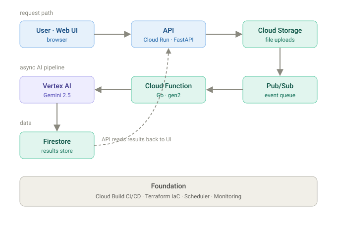
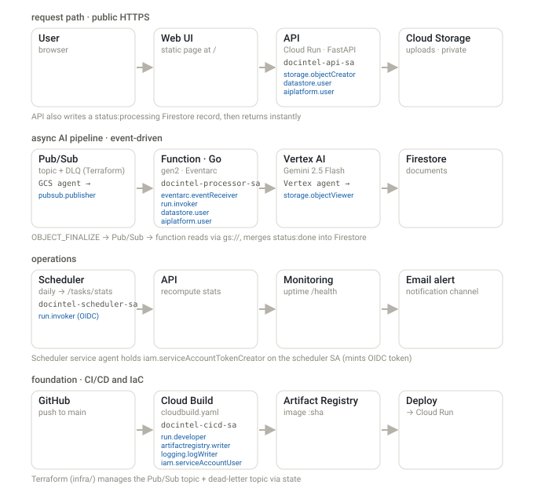

# DocIntel — Serverless AI on Google Cloud

A production-shaped, serverless **AI platform on GCP**: a document-intelligence
pipeline **plus** a **multi-agent assistant** that answers questions over real data by
routing between text-to-SQL (BigQuery) and vector search (Firestore) — with grounded,
cited answers and persistent conversation memory. Built **level by level** to
demonstrate real cloud architecture, not a single script.

### 🔗 Live demo — https://docintel-api-825091457104.us-central1.run.app/

> First message after idle takes ~40s (serverless cold start + the agents thinking);
> after that, ~15–25s per answer.

---

## What it does

**1. Multi-agent assistant** (`services/agent`)
A **LangGraph supervisor multi-agent** (6 agents): a supervisor routes each question to
the right specialist, which uses its tools, and a synthesizer returns a grounded answer.
Conversations are remembered (Firestore-backed threads).

| Specialist | Tool | Data |
|-----------|------|------|
| `financials_analyst` | text-to-SQL | BigQuery — company revenue / net income |
| `complaints_analyst` | SQL + vector RAG | BigQuery + Firestore — 150 real CFPB mortgage complaints |
| `document_librarian` | vector RAG | Firestore — uploaded docs + product handbook |
| `general_assistant` | Gemini | general knowledge |

The rule it enforces: **exact facts (financials, counts) come from SQL; narrative comes
from vector search** — never embed numbers you need precisely. Each answer shows which
agent handled it, and abstains rather than fabricating.

**2. Document intelligence** (`services/api` + `services/processor-go`)
Upload a document → stored in Cloud Storage → an event on Pub/Sub triggers a **Go**
Cloud Function → Gemini extracts a summary, entities, and a document type
(schema-constrained JSON) → results in Firestore, browsable in the UI.

## Data you can query

- **Company financials** — BigQuery `docintel.financials`: Northwind Traders, Contoso Ltd,
  Globex Corp (revenue & net income, 2023–2024)
- **Consumer complaints** — BigQuery `docintel.cfpb_complaints` + narrative vectors: 150
  real complaints from the public **CFPB Consumer Complaint** API (mortgages)
- **Documents** — Firestore vector search over uploaded files + a product handbook

## Architecture



Detailed view — every service annotated with its service account, IAM roles, and trigger:



Design decisions and per-level notes: [docs/architecture.md](docs/architecture.md).

## Built with

Cloud Run · Vertex AI (Gemini) · Firestore (vector search + threads) · BigQuery ·
Cloud Storage · Pub/Sub · Cloud Functions (Go) · Cloud Scheduler · Cloud Monitoring ·
LangGraph (supervisor multi-agent) · Terraform · Cloud Build CI/CD — all on
least-privilege service accounts.

## How it was built — the L0→L5 platform

| Level | Focus | Key services |
|-------|-------|--------------|
| L0 | Foundations | Project, billing, budget, APIs, repo |
| L1 | API + AI | Cloud Run, Vertex AI (Gemini), Artifact Registry |
| L2 | Storage | Cloud Storage, Firestore |
| L3 | Async | Pub/Sub, Cloud Functions |
| L4 | Frontend + ops | Web UI, Cloud Scheduler, Monitoring, least-privilege IAM |
| L5 | Production polish | Go rewrite, Cloud Build CI/CD, Terraform |
| **+** | **AI layer** | **RAG (Firestore vectors) · tool-using agent · multi-agent + threads** |

**🏆 L0→L5 complete**, then extended with the RAG + multi-agent assistant.

<details>
<summary>Detailed progress log</summary>

- [x] **L0** project, billing, `$10` budget + alerts, APIs, repo
- [x] **L1** FastAPI `/ask` → Gemini, containerized, deployed to Cloud Run
- [x] **L2** `/upload` → Cloud Storage + schema-constrained Gemini analysis → Firestore; `/documents`
- [x] **L3** async: bucket → Pub/Sub → gen2 Cloud Function → Firestore (`processing`→`done`)
- [x] **L4** web UI · least-privilege SAs (retired `roles/editor`) · Cloud Scheduler (OIDC) · Monitoring uptime + alert
- [x] **L5.1** processor rewritten in **Go** (`services/processor-go`, `go126`)
- [x] **L5.2** **Cloud Build CI/CD** — GitHub trigger on push to `main`, dedicated `docintel-cicd-sa`
- [x] **L5.3** **Terraform** (`infra/`) — created a dead-letter topic + imported the live topic
- [x] **RAG** — chunk + embed → Firestore vector search; agentic self-correcting LangGraph (grade + rewrite loop + groundedness check + abstain)
- [x] **Agent** — `create_react_agent` with text-to-SQL + vector tools; the model picks the tool
- [x] **Multi-agent** — LangGraph supervisor (6 agents) + Firestore threaded memory + self-documenting dashboard

</details>

## Layout

```
services/
  api/            # Cloud Run: /upload, /documents, /stats + serves the dashboard UI
  processor/      # Python Cloud Function (original processor, kept as reference)
  processor-go/   # Go Cloud Function (deployed) — Pub/Sub-triggered Gemini analysis
  rag/            # RAG: ingest, retrieve, LangGraph agentic graph (Firestore vectors)
  agent/          # tool-using agent + supervisor multi-agent + threads + chat UI
infra/            # Terraform (IaC)
docs/             # architecture notes + diagrams
cloudbuild.yaml   # CI/CD pipeline (build → push → deploy API + agent)
```

## Key identifiers

| Thing | Value |
|-------|-------|
| Project | `docintel-srg-2026` (`825091457104`) · region `us-central1` |
| Dashboard | https://docintel-api-825091457104.us-central1.run.app |
| Agent API | https://docintel-agent-825091457104.us-central1.run.app |
